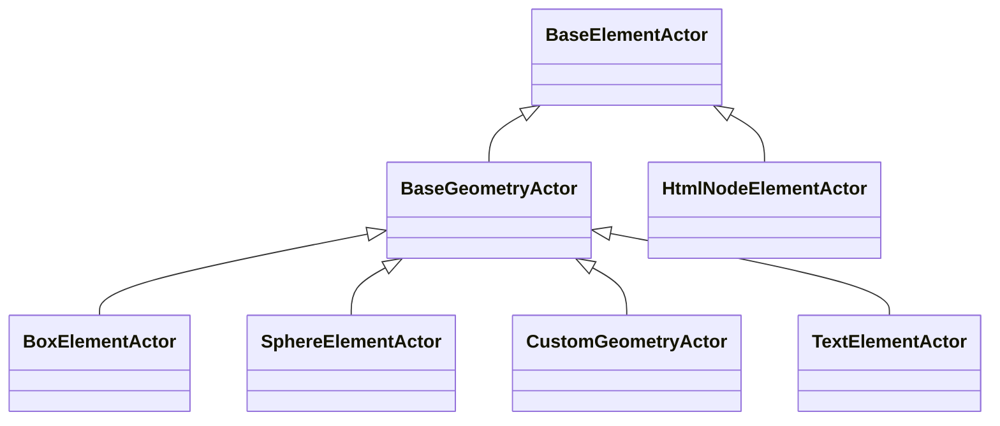

# Element Actors Architecture

## Overview

The Element Actors system provides a flexible and extensible way to render different types of nodes in the SpaceGraph visualization. By using an inheritance-based approach with a common `BaseElementActor` base class, we've eliminated code duplication and created a maintainable architecture.

## Class Hierarchy



## BaseElementActor

The `BaseElementActor` is an abstract base class that defines the common interface and functionality for all element actors:

- Common initialization and disposal patterns
- Shared utility methods for working with Three.js objects
- Standardized event handling
- Consistent state management integration

## BaseGeometryActor

The `BaseGeometryActor` extends `BaseElementActor` and provides specialized functionality for geometry-based actors:

- Glow effect implementation with customizable parameters
- Automatic disposal of Three.js resources
- Optimized rendering for geometric shapes
- Shared material management

### Glow Effect System

The glow effect is implemented using a post-processing approach with additive blending:

1. Main mesh with primary material
2. Glow mesh with emissive material and slight scaling
3. Additive blending for the glow effect
4. Configurable glow strength and color

## Concrete Implementations

### BoxElementActor

Renders nodes as Three.js BoxGeometry with customizable:
- Size (width, height, depth)
- Color
- Glow effects

### SphereElementActor

Renders nodes as Three.js SphereGeometry with customizable:
- Radius
- Width and height segments
- Color
- Glow effects

### CustomGeometryActor

Renders nodes using custom Three.js geometries:
- Supports any BufferGeometry
- Configurable material properties
- Glow effects

### TextElementActor

Renders nodes as text labels:
- Configurable font family, size, and weight
- Text color customization
- Background color support
- Glow effects

### HtmlNodeElementActor

Renders nodes as HTML elements:
- Full HTML/CSS support
- DOM manipulation for dynamic content
- Integration with CSS3DRenderer

## Performance Optimizations

1. **Resource Management**: Proper disposal of Three.js objects to prevent memory leaks
2. **Object Pooling**: Integration with global object pooling system for frequently created objects
3. **Batch Updates**: Efficient state updates through SolidJS reactive system
4. **Lazy Initialization**: Resources created only when needed

## Extension Guide

To create a new element actor type:

1. Extend either `BaseElementActor` or `BaseGeometryActor`
2. Implement required abstract methods:
   - `createElement()`: Create the Three.js object
   - `updateElement()`: Update the object when state changes
3. Override optional methods as needed:
   - `dispose()`: Custom cleanup logic
   - `onStateChange()`: Handle specific state changes
4. Register the actor with `SpaceGraph.registerType()`

## Usage Examples

### Registering a Custom Actor

```typescript
class CustomActor extends BaseGeometryActor {
  protected createElement(): THREE.Object3D {
    // Implementation
  }
  
  protected updateElement(): void {
    // Implementation
  }
}

SpaceGraph.registerType('custom', CustomActor);
```

### Using in Node Specification

```typescript
const node: NodeSpec = {
  id: 'node1',
  type: 'sphere',
  data: {
    radius: 0.5,
    glow: {
      color: '#ff0000',
      strength: 0.8
    }
  }
};