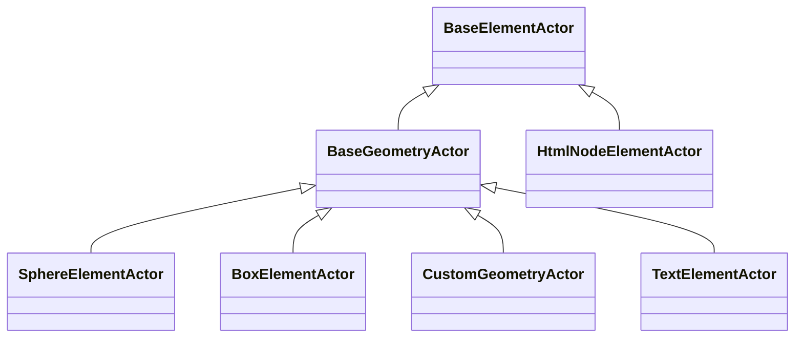

# Element Actors - Consolidated Documentation

## Overview

Element Actors provide a flexible and extensible way to render different types of nodes in SpaceGraphJS visualizations.
The system uses an inheritance-based approach with a common `BaseElementActor` base class to eliminate code duplication
and create a maintainable architecture.

## Class Hierarchy



## Base Classes

### BaseElementActor

The `BaseElementActor` is an abstract base class that defines the common interface and functionality for all element
actors:

- Common initialization and disposal patterns
- Shared utility methods for working with Three.js objects
- Standardized event handling
- Consistent state management integration

#### Key Methods

- `init()`: Initialize the actor, create Three.js objects, and set up reactive effects
- `getRaycastableObject()`: Return the Three.js object for raycasting
- `dispose()`: Clean up all resources including Three.js objects and SolidJS effects

### BaseGeometryActor

The `BaseGeometryActor` extends `BaseElementActor` and provides specialized functionality for geometry-based actors:

- Glow effect implementation with customizable parameters
- Automatic disposal of Three.js resources
- Optimized rendering for geometric shapes
- Shared material management
- Animation support for property changes

#### Glow Effect System

The glow effect is implemented using a post-processing approach with additive blending:

1. Main mesh with primary material
2. Glow mesh with emissive material and slight scaling
3. Additive blending for the glow effect
4. Configurable glow strength and color

#### Animation System

Geometry actors support smooth animations for property changes:

- Position transitions with easing functions
- Color transitions with easing functions
- Glow effect fade in/out animations
- Configurable animation durations

## Concrete Implementations

### SphereElementActor

Renders nodes as Three.js SphereGeometry with customizable properties.

#### Features

- Configurable radius
- Glow effects for selection/hover states
- Color management with hex expansion
- BVH acceleration support
- Reactive updates for position, color, and visual states

#### Configuration

```typescript
interface NodeSpec {
  radius?: number;  // Sphere radius (default: 0.5)
}
```

### BoxElementActor

Renders nodes as Three.js BoxGeometry with customizable dimensions and rounded corners.

#### Features

- Configurable width, height, and depth
- Optional rounded corners
- Glow effects for selection/hover states
- Color management
- BVH acceleration support
- Reactive updates

#### Configuration

```typescript
interface BoxNodeSpec extends NodeSpec {
  width?: number;    // Box width (default: 1.0)
  height?: number;   // Box height (default: 1.0)  
  depth?: number;    // Box depth (default: 1.0)
  rounded?: boolean; // Use rounded box geometry (default: false)
}
```

### TextElementActor

Renders nodes as 3D text labels with advanced text features.

#### Features

- Configurable font family, size, and weight
- Text color customization
- Background color support
- Glow effects
- Multi-line text support
- Text wrapping
- Alignment options
- Bold and italic styling
- Asynchronous font loading

#### Configuration

```typescript
interface TextNodeSpec extends NodeSpec {
  text?: string;                 // Text content (defaults to label or ID)
  font?: string;                 // Font family (default: 'helvetiker')
  size?: number;                 // Text size (default: 0.5)
  depth?: number;                // Text depth/extrusion (default: 0.1)
  color?: string;                // Text color (defaults to node color)
  align?: 'left' | 'center' | 'right'; // Text alignment (default: 'center')
  lineHeight?: number;           // Line height for multi-line text (default: 1.2)
  maxWidth?: number;             // Maximum width for text wrapping (default: Infinity)
  bold?: boolean;                // Bold text (default: false)
  italic?: boolean;              // Italic text (default: false)
}
```

### CustomGeometryActor

Renders nodes using custom Three.js geometries from various formats.

#### Features

- Support for multiple geometry formats (GLTF, OBJ, FBX, PLY, STL)
- Configurable material properties
- Glow effects
- BVH acceleration support
- Reactive updates
- Asynchronous geometry loading

#### Configuration

```typescript
interface CustomGeometryNodeSpec extends NodeSpec {
  url: string;                    // URL to load the geometry from
  format?: 'gltf' | 'glb' | 'obj' | 'fbx' | 'ply' | 'stl'; // Format of the geometry file
  material?: THREE.MaterialParameters; // Material properties for the geometry
}
```

### HtmlNodeElementActor

Renders nodes as HTML elements in 3D space.

#### Features

- Full HTML/CSS support
- DOM manipulation for dynamic content
- Integration with CSS3DRenderer
- Event handling for HTML interactions
- Responsive sizing
- Z-order management

#### Configuration

```typescript
interface HtmlNodeSpec extends NodeSpec {
  content?: string;   // HTML string content to display
  className?: string; // CSS class name to apply to the node container
}
```

## Performance Optimizations

### Resource Management

- Proper disposal of Three.js objects to prevent memory leaks
- Double-disposal prevention using tracking mechanisms
- Efficient resource cleanup for textures, materials, and geometries

### Object Pooling

- Integration with global object pooling system for frequently created objects
- Reuse of common geometries and materials
- Reduced garbage collection pressure

### Batch Updates

- Efficient state updates through SolidJS reactive system
- Batched property changes to minimize re-renders

### Lazy Initialization

- Resources created only when needed
- Deferred loading of fonts and geometries

## Extension Guide

To create a new element actor type:

1. Extend either `BaseElementActor` or `BaseGeometryActor`
2. Implement required abstract methods:
    - `init()`: Create the Three.js object
    - `getRaycastableObject()`: Return the object for raycasting
    - `dispose()`: Custom cleanup logic
3. Override optional methods as needed:
    - `update()`: Handle state changes
4. Register the actor with `SpaceGraph.registerType()`

### Example Custom Actor

```typescript
class CustomActor extends BaseGeometryActor {
  protected createGeometry(): THREE.BufferGeometry {
    // Create and return the geometry
  }
  
  protected createGlowGeometry(): THREE.BufferGeometry {
    // Create and return the glow geometry (optional override)
  }
}

SpaceGraph.registerType('custom', CustomActor);
```

## Usage Examples

### Registering a Custom Actor

```typescript
class CustomActor extends BaseGeometryActor {
  protected createGeometry(): THREE.BufferGeometry {
    // Implementation
  }
}

SpaceGraph.registerType('custom', CustomActor);
```

### Using in Node Specification

```typescript
const node: NodeSpec = {
  id: 'node1',
  type: 'sphere',
  data: {
    radius: 0.5,
    glow: {
      color: '#ff0000',
      strength: 0.8
    }
  }
};
```

### Mixed Node Types Example

```javascript
const spec = {
  data: {
    nodes: [
      { id: '1', type: 'sphere', position: { x: -2, y: 0, z: 0 }, color: '#ff0000' },
      { id: '2', type: 'box', position: { x: 0, y: 0, z: 0 }, color: '#00ff00' },
      { id: '3', type: 'text', position: { x: 2, y: 0, z: 0 }, text: 'Hello', color: '#0000ff' },
      { id: '4', type: 'custom', position: { x: 4, y: 0, z: 0 }, url: '/models/my-model.glb' },
      { id: '5', type: 'html', position: { x: 6, y: 0, z: 0 }, content: '<div>HTML Node</div>' }
    ],
    edges: [
      { id: 'e1', source: '1', target: '2' },
      { id: 'e2', source: '2', target: '3' },
      { id: 'e3', source: '3', target: '4' },
      { id: 'e4', source: '4', target: '5' }
    ]
  }
};
```

## Best Practices

### For Performance

1. Use instancing for large numbers of similar nodes
2. Implement proper disposal to prevent memory leaks
3. Use object pooling for frequently created/destroyed objects
4. Minimize geometry complexity when possible

### For Custom Actors

1. Always call super methods in overridden functions
2. Implement proper disposal of created resources
3. Use reactive updates rather than manual polling
4. Follow the established patterns for consistency

### For Styling

1. Use the standardized style properties for consistency
2. Implement hover and selection states when appropriate
3. Consider accessibility in color choices
4. Test with various color schemes and themes